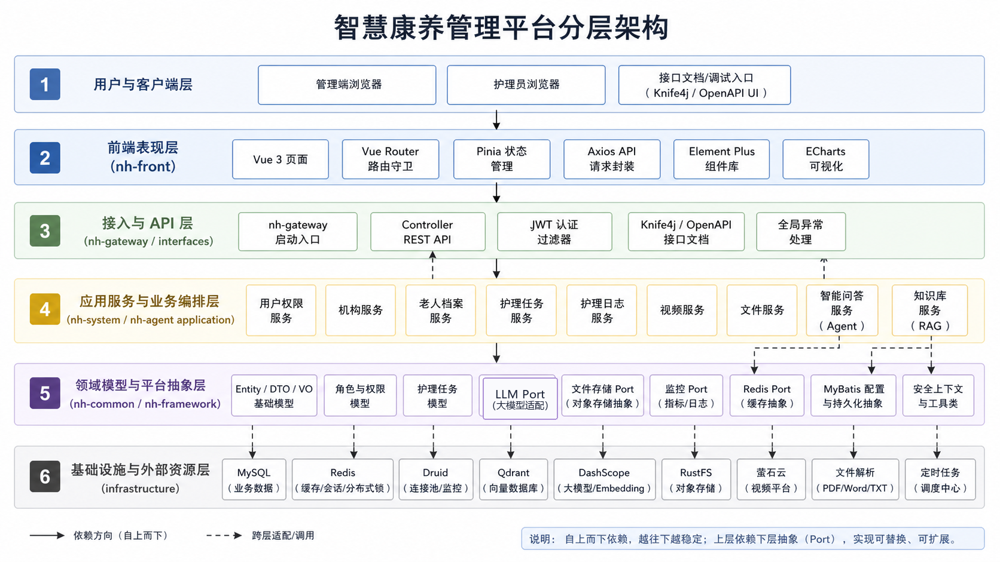

<h1 align="center">Smart Nursing Home Management Platform</h1>

<p align="center">
  English | <a href="./README.md">简体中文</a>
</p>

A full-stack smart nursing home management platform for elder-care institutions, nursing teams, and management users. The backend is a Java 17 and Spring Boot 3.5 multi-module project, while the frontend is built with Vue 3, TypeScript, and Vite. The system covers institution management, elder records, nursing tasks, nursing logs, role-based access control, file storage, video monitoring, system monitoring, knowledge-base management, and AI-assisted Q&A.


## Table of Contents

- [Features](#features)
- [Architecture](#architecture)
- [Tech Stack](#tech-stack)
- [Repository Structure](#repository-structure)
- [Requirements](#requirements)
- [Quick Start](#quick-start)
- [Configuration](#configuration)
- [External Services](#external-services)
- [Initial Data and Accounts](#initial-data-and-accounts)
- [Business Workflows](#business-workflows)
- [API and Pages](#api-and-pages)
- [Development](#development)
- [Deployment](#deployment)
- [Acceptance Checklist](#acceptance-checklist)
- [FAQ](#faq)
- [License](#license)

## Features

### Business Management

- Institution management: maintain nursing-home profiles, contacts, bed counts, business identifiers, images, and detail pages.
- Elder records: manage elder profiles, institution ownership, guardians, admission information, self-care level, and attachments.
- Nursing task templates: define recurring care tasks by daily, weekly, or monthly schedules.
- Nursing task dispatching: assign care tasks to nurses with target elder, task type, priority, planned time, and notes.
- Nursing logs: nurses record task completion, care details, abnormal conditions, and attachments.
- Video monitoring: manage cameras, retrieve Ezviz playback configuration, process alerts, and trigger PTZ operations.
- File management: use RustFS/S3-compatible storage for avatars, institution images, elder attachments, nursing-log attachments, and knowledge-base files.

### Platform Capabilities

- User, role, resource permission, and data-scope management.
- JWT authentication, CAPTCHA login, online-user management, and login-log management.
- Redis monitoring, server monitoring, Druid datasource monitoring, and Knife4j/OpenAPI documentation.
- Dynamic frontend navigation based on user resource paths and route-guard permission refresh.

### AI Capabilities

- Multi-turn AI chat, streaming responses, conversation history, and contextual memory.
- DashScope chat and embedding model integration.
- Qdrant-backed vector-store management, document upload, chunking, retrieval, and RAG-based Q&A.
- Permission-aware internal data query tools.
- Configurable switches for LLM, RAG, tool calling, memory, and guardrails.

## Architecture

<p align="center">
  
</p>

The backend starts from `nh-gateway`, whose main class is `com.zhiling.gateway.NhGatewayApplication`. `nh-system` contains the core business modules, `nh-agent` contains AI and RAG capabilities, `nh-framework` provides security, Redis, MyBatis, monitoring, storage, and LLM port abstractions, and `nh-common` contains shared models, constants, exceptions, and utilities.

## Tech Stack

| Layer | Technology |
| --- | --- |
| Backend Language | Java 17 |
| Backend Framework | Spring Boot 3.5.0, Spring Security, Spring Web |
| ORM | MyBatis-Plus 3.5.5 |
| Database | MySQL 8.x |
| Cache | Redis 6.x+ |
| Datasource Pool | Druid |
| API Documentation | Knife4j / OpenAPI |
| AI Framework | Spring AI, Spring AI Alibaba |
| Model Provider | DashScope |
| Vector Database | Qdrant |
| Object Storage | RustFS / S3 Compatible |
| Video Platform | Ezviz Open Platform, EZUIKit |
| Frontend | Vue 3, TypeScript, Vite |
| Frontend Ecosystem | Pinia, Vue Router, Element Plus, ECharts, Axios |

## Repository Structure

```text
nursing-house/
├── nh-common/       Shared constants, entities, DTOs, VOs, exceptions, utilities, and context models
├── nh-framework/    Platform abstractions, security context, ports, MyBatis configuration, infrastructure support
├── nh-system/       Users, roles, institutions, elders, nursing, files, monitoring, video, vector-store modules
├── nh-agent/        AI chat, sessions, RAG, prompts, tool calling, multimodal processing
├── nh-gateway/      Spring Boot startup module
├── nh-front/        Vue 3 frontend project
├── sql/             MySQL initialization script
├── docs/images/     README image assets
├── pom.xml          Maven parent project
├── README.md        Chinese README
├── README_EN.md     English README
└── LICENSE          AGPL-3.0 license
```

## Requirements

| Dependency | Recommended Version | Required | Notes |
| --- | --- | --- | --- |
| JDK | 17 | Yes | Backend build and runtime |
| Maven | 3.8+ | Yes | Backend dependency management and packaging |
| Node.js | 18+ / 20+ | Yes | Frontend development and build |
| npm | Bundled with Node.js | Yes | Frontend dependency installation |
| MySQL | 8.x | Yes | Business data, accounts, permissions, configuration, logs |
| Redis | 6.x+ | Yes | CAPTCHA, tokens, online sessions, AI memory |
| DashScope | Online service | Optional | Chat model, embeddings, RAG |
| Qdrant | 1.13.x | Optional | Knowledge-base vector retrieval |
| RustFS | S3 compatible | Optional | File upload, avatars, attachments, institution images |
| Ezviz | Online service | Optional | Real camera playback, PTZ, alerts |

For basic business verification, MySQL, Redis, backend, and frontend are enough. File, video, knowledge-base, and AI features can be configured later when those modules need to be verified.

## Quick Start

### 1. Clone

```bash
git clone https://github.com/zhanghongyu04/smart-nursing-house.git
cd nursing-house
```

### 2. Create and Import the Database

```sql
CREATE DATABASE IF NOT EXISTS `nursing-home`
  DEFAULT CHARACTER SET utf8mb4
  COLLATE utf8mb4_0900_ai_ci;
```

```bash
mysql -u root -p nursing-home < sql/nursing-home.sql
```

### 3. Configure Development Environment Variables

PowerShell:

```powershell
$env:NURSING_HOUSE_DB_USERNAME="root"
$env:NURSING_HOUSE_DB_PASSWORD="your_mysql_password"
$env:NURSING_HOUSE_DRUID_PASSWORD="your_druid_password"
$env:NURSING_HOUSE_DEFAULT_PASSWORD="InitPwd@123"
$env:NURSING_HOUSE_TOKEN_SECRET="replace-with-a-long-random-secret-at-least-32-bytes"
$env:NURSING_HOUSE_REDIS_PASSWORD=""
```

Bash:

```bash
export NURSING_HOUSE_DB_USERNAME=root
export NURSING_HOUSE_DB_PASSWORD=your_mysql_password
export NURSING_HOUSE_DRUID_PASSWORD=your_druid_password
export NURSING_HOUSE_DEFAULT_PASSWORD=InitPwd@123
export NURSING_HOUSE_TOKEN_SECRET=replace-with-a-long-random-secret-at-least-32-bytes
export NURSING_HOUSE_REDIS_PASSWORD=
```

Configure RustFS, DashScope, Qdrant, and Ezviz variables if you need to verify file storage, AI, knowledge-base, or video features.

### 4. Start Backend

```bash
mvn -pl nh-gateway -am spring-boot:run -Dspring-boot.run.profiles=dev
```

Or package and run:

```bash
mvn -pl nh-gateway -am clean package -DskipTests
java -jar nh-gateway/target/nh-gateway-1.0-SNAPSHOT.jar --spring.profiles.active=dev
```

Default backend URL:

```text
http://localhost:8080
```

### 5. Start Frontend

```bash
cd nh-front
npm install
npm run dev
```

The Vite dev server currently runs on `5175` and proxies `/api` to `http://localhost:8080`.

```text
http://localhost:5175
```

### 6. Useful URLs

| URL | Description |
| --- | --- |
| `http://localhost:5175` | Frontend dev server |
| `http://localhost:8080/doc.html` | Knife4j API documentation |
| `http://localhost:8080/druid/` | Druid datasource monitor |
| `http://localhost:8080/api/v1/captcha` | CAPTCHA API |

## Configuration

The default profile is configured in `nh-gateway/src/main/resources/application.yml` as `${SPRING_PROFILES_ACTIVE:dev}`. If `SPRING_PROFILES_ACTIVE` is not set, the `dev` profile is used.

### Minimum dev Configuration

`application-dev.yml` defaults:

- Backend port: `8080`
- MySQL: `localhost:3306/nursing-home`
- Redis: `localhost:6379`
- Qdrant gRPC: `localhost:6334`
- RustFS: `http://localhost:9000`
- Frontend port: `5175`

| Environment Variable | Default | Required | Purpose |
| --- | --- | --- | --- |
| `NURSING_HOUSE_DB_USERNAME` | `root` | No | MySQL username |
| `NURSING_HOUSE_DB_PASSWORD` | None | Yes | MySQL password |
| `NURSING_HOUSE_DRUID_USERNAME` | `admin` | No | Druid monitor username |
| `NURSING_HOUSE_DRUID_PASSWORD` | None | Yes | Druid monitor password |
| `NURSING_HOUSE_REDIS_PASSWORD` | Empty | Depends on Redis | Redis password |
| `NURSING_HOUSE_DEFAULT_PASSWORD` | None | Recommended | Default password for new or reset users |
| `NURSING_HOUSE_TOKEN_SECRET` | None | Yes | JWT HS256 signing secret |
| `NURSING_HOUSE_DASHSCOPE_API_KEY` | None | Required for AI | DashScope API key |
| `NURSING_HOUSE_RUSTFS_ACCESS_KEY_ID` | None | Required for file storage | RustFS access key |
| `NURSING_HOUSE_RUSTFS_SECRET_ACCESS_KEY` | None | Required for file storage | RustFS secret key |
| `NURSING_HOUSE_EZVIZ_APP_KEY` | Empty | Required for real video | Ezviz app key |
| `NURSING_HOUSE_EZVIZ_APP_SECRET` | Empty | Required for real video | Ezviz app secret |

### Minimum prod Configuration

Set `SPRING_PROFILES_ACTIVE=prod` explicitly in production. Database, Redis, Qdrant, RustFS, and third-party credentials should be injected through environment variables or platform secrets.

```powershell
$env:SPRING_PROFILES_ACTIVE="prod"
$env:SERVER_PORT="8080"

$env:NURSING_HOUSE_DB_URL="jdbc:mysql://127.0.0.1:3306/nursing-home?serverTimezone=Asia/Shanghai&useUnicode=true&characterEncoding=utf-8&useSSL=false&allowPublicKeyRetrieval=true"
$env:NURSING_HOUSE_DB_USERNAME="nh_user"
$env:NURSING_HOUSE_DB_PASSWORD="your_mysql_password"

$env:NURSING_HOUSE_REDIS_HOST="127.0.0.1"
$env:NURSING_HOUSE_REDIS_PORT="6379"
$env:NURSING_HOUSE_REDIS_PASSWORD=""

$env:NURSING_HOUSE_TOKEN_SECRET="replace-with-a-long-random-secret-at-least-32-bytes"
$env:NURSING_HOUSE_DEFAULT_PASSWORD="InitPwd@123"
```

Additional production variables include `NURSING_HOUSE_DASHSCOPE_API_KEY`, `NURSING_HOUSE_QDRANT_HOST`, `NURSING_HOUSE_RUSTFS_ENDPOINT`, `NURSING_HOUSE_RUSTFS_ACCESS_KEY_ID`, `NURSING_HOUSE_RUSTFS_SECRET_ACCESS_KEY`, `NURSING_HOUSE_EZVIZ_APP_KEY`, and `NURSING_HOUSE_EZVIZ_APP_SECRET` when the corresponding features are enabled.

## External Services

### MySQL

Use MySQL 8.x, create the `nursing-home` database, and import `sql/nursing-home.sql`. If the menu is empty after login, check whether SQL import, user-role mapping, or role-resource mapping is incomplete.

### Redis

The default port is `6379`. DB0 is used for CAPTCHA, tokens, and online-user state. DB1 is used for AI memory. If Redis has authentication enabled, set `NURSING_HOUSE_REDIS_PASSWORD`.

### Qdrant

Qdrant HTTP/Web UI usually uses `6333`, while this project connects through gRPC port `6334`.

```bash
docker run -p 6333:6333 -p 6334:6334 qdrant/qdrant:v1.13.6
```

For first deployment, set `NURSING_HOUSE_QDRANT_INITIALIZE_SCHEMA=true` or create the collection manually.

### RustFS

RustFS S3 API defaults to `9000`, and the console usually uses `9001`. The endpoint must include a protocol, such as `http://localhost:9000`. The default bucket is `nursing-home`.

### DashScope

Create an API key from DashScope or Alibaba Cloud Model Studio and configure `NURSING_HOUSE_DASHSCOPE_API_KEY`. Knowledge-base upload depends on both DashScope embeddings and Qdrant.

### Ezviz

Create an Ezviz Open Platform application to obtain App Key and App Secret. Real video playback also requires camera serial number, channel number, verification code, and online device status. The seed camera is only a data-structure example.

## Initial Data and Accounts

`sql/nursing-home.sql` contains the required seed data for menus, resources, roles, dictionaries, platform configuration, sample accounts, and sample institutions.

| Account | Initial Password | Role | Institution Scope | Main Modules |
| --- | --- | --- | --- | --- |
| `admin1` | `123456` | Government/platform administrator | Global | Institutions, elders, system management, knowledge base, agent, video, monitoring |
| `user1` | `admin123` | Parent institution administrator | `149`, `150` | Institutions, elders, user management, knowledge base, agent, video, nursing management |
| `user2` | `admin123` | Institution administrator | `150` | Institutions, elders, user management, knowledge base, agent, video, nursing management |
| `nurse` | `admin123` | Nurse | `149` | Elder information, care agent, my nursing tasks |

The SQL stores bcrypt password hashes. Use the initial passwords above to log in, and change account passwords before long-term use.

Seed elder records, nursing tasks, nursing logs, AI sessions, AI messages, login logs, and institution images start empty, so the business flow can be verified from a clean state. The sample institutions are `149 青山康养中心` and `150 暖阳护理院分院`.

## Business Workflows

### Login and Permissions

1. Open `http://localhost:5175/login`.
2. Fetch CAPTCHA through `GET /api/v1/captcha`.
3. Log in through `POST /api/v1/login`.
4. After login, fetch navigation and permission information through `GET /api/v1/user/getUserNavInfo`.
5. The frontend renders menus based on resource paths, so different accounts see different modules.

### Institution Management

1. Open `/nursingHomeList` with `admin1` or another authorized account.
2. Query the list through `POST /api/v1/sanatorium/page`.
3. Add, update, or delete institutions through `/api/v1/sanatorium/add`, `/update`, and `/delete`.
4. Use `/nursingHomeDetail` for self-care distribution, elder list, and institution images.

### Elder Records

1. Open `/elderInfo`.
2. Query records through `POST /api/v1/elder/page`.
3. Add an elder with institution, name, gender, age, phone, admission type, self-care level, bed, room, fee, guardian, and admission date.
4. Upload elder attachments through `/api/v1/elder/attachments/upload`.

### Nursing Tasks and Logs

1. `user1` or `user2` creates recurring templates in `/nursingTaskTemplate`.
2. Dispatch nursing tasks in `/nursingTaskDispatch`.
3. `nurse` views assigned tasks in `/myNursingTask`.
4. After completing a task, the nurse writes a log in `/writeNursingLog`.
5. Institution administrators review and export logs in `/nursingLog`.

### Video Monitoring

1. Open `/Monitor`.
2. Query cameras through `GET /api/v1/video/list`.
3. Retrieve playback configuration through `GET /api/v1/video/{cameraId}/play-config`.
4. Real playback and PTZ require valid Ezviz credentials and real camera information.

### AI Agent and Knowledge Base

1. Upload PDF, Word, or TXT files in `/vectorStore`.
2. The system chunks documents, generates embeddings, and writes vectors to Qdrant.
3. Open `/agent` to create conversations and ask questions.
4. AI features depend on DashScope, Qdrant, and Redis.

## API and Pages

### API Groups

| Capability | Main API |
| --- | --- |
| Authentication | `/api/v1/login`, `/api/v1/logout`, `/api/v1/captcha` |
| Navigation | `/api/v1/user/getUserNavInfo` |
| Institutions | `/api/v1/sanatorium/**` |
| Elders | `/api/v1/elder/**` |
| Nursing Task Templates | `/api/v1/nursing-task-template/**` |
| Nursing Tasks | `/api/v1/nursing-task/**` |
| Nursing Logs | `/api/v1/nursing-log/**` |
| Files | `/api/v1/commonFile/**`, `/api/v1/rustfs/**` |
| Video | `/api/v1/video/**` |
| Monitoring | `/api/v1/monitor/**` |
| Vector Store | `/api/v1/vector-store/**` |
| Agent | `/api/v1/agent/**` |
| LLM Compatible API | `/api/llm/**` |

Permission resources usually use `/web/...`, while business requests call `/api/v1/...`.

### Main Frontend Routes

| Route | Feature |
| --- | --- |
| `/login` | Login |
| `/` | Dashboard |
| `/nursingHomeList` | Institution list |
| `/nursingHomeDetail` | Institution detail |
| `/elderInfo` | Elder records |
| `/userManage` | User management |
| `/permission` | Permission management |
| `/Monitor` | Video monitoring |
| `/CacheControl` | Redis monitoring |
| `/ServiceControl` | Server monitoring |
| `/LoginMonitor` | Login and online-user monitoring |
| `/agent` | AI agent |
| `/vectorStore` | Knowledge-base management |
| `/nursingTaskTemplate` | Nursing task templates |
| `/nursingTaskDispatch` | Nursing task dispatch |
| `/nursingLog` | Nursing log management |
| `/myNursingTask` | Nurse task list |
| `/writeNursingLog` | Nurse log editor |

## Development

### Backend

```bash
mvn clean package -DskipTests
mvn -pl nh-gateway -am package -DskipTests
mvn -pl nh-gateway -am spring-boot:run -Dspring-boot.run.profiles=dev
```

Guidelines:

- Keep controllers thin and move business logic into application/domain services.
- Use ports for cross-module and infrastructure capabilities.
- Update permission resources, role bindings, frontend routes, and menus when adding APIs.
- Update entities, mappers, DTOs/VOs, frontend types, and SQL when changing database fields.

### Frontend

```bash
cd nh-front
npm install
npm run dev
npm run build
npm run preview
```

Guidelines:

- Keep API calls in `src/api/`.
- Keep pages in `src/views/` and reusable components in `src/components/`.
- Manage authentication and permissions through Pinia stores.
- The dev server only proxies `/api`; update proxy or request wrappers when adding other prefixes.

## Deployment

### Backend

```bash
mvn -pl nh-gateway -am clean package -DskipTests
java -jar nh-gateway/target/nh-gateway-1.0-SNAPSHOT.jar --spring.profiles.active=prod
```

Use environment variables or platform secrets for MySQL, Redis, DashScope, Qdrant, RustFS, Ezviz, and JWT secrets.

### Frontend

```bash
cd nh-front
npm install
npm run build
```

The output is `nh-front/dist`. A typical Nginx deployment serves the static assets and proxies `/api/` to the backend:

```nginx
server {
    listen 80;
    server_name nursing-house.example.com;

    root /opt/nursing-house/nh-front/dist;
    index index.html;

    location / {
        try_files $uri $uri/ /index.html;
    }

    location /api/ {
        proxy_pass http://127.0.0.1:8080/api/;
        proxy_http_version 1.1;
        proxy_set_header Host $host;
        proxy_set_header X-Real-IP $remote_addr;
        proxy_set_header X-Forwarded-For $proxy_add_x_forwarded_for;
        proxy_set_header X-Forwarded-Proto $scheme;
        proxy_read_timeout 300s;
    }

    client_max_body_size 50m;
}
```

Production notes:

- Use HTTPS.
- Use a dedicated database account with minimal permissions.
- Avoid exposing MySQL, Redis, RustFS, and Qdrant directly to the public internet.
- Manage JWT secrets and third-party credentials through environment variables or secret managers.
- Restrict Druid, Knife4j, and monitoring endpoints to trusted networks when possible.

## Acceptance Checklist

| Item | Check | Expected Result |
| --- | --- | --- |
| Environment | MySQL, Redis, backend, frontend | Backend 8080 and frontend 5175 are accessible |
| Data | Import `sql/nursing-home.sql` | Four sample accounts can log in |
| Permissions | Log in as `admin1`, `user1`, `user2`, `nurse` | Menus match role and institution scope |
| Institution | Query institution list and detail | Only authorized institutions are visible |
| Elder | Add elder and upload attachment | Elder appears in list and attachment is accessible |
| Nursing | Dispatch task, complete task, write log | Task status and nursing log are correct |
| File | Check `/api/v1/rustfs/health` and upload file | RustFS is healthy and file is accessible |
| AI | Upload document and ask question | Qdrant has data and agent returns response |
| Video | Configure a real Ezviz device | Playback configuration is returned |
| Documentation | Open `/doc.html` | Knife4j is accessible |

## FAQ

### Backend fails because placeholders cannot be resolved

Check required variables such as `NURSING_HOUSE_DB_PASSWORD`, `NURSING_HOUSE_DRUID_PASSWORD`, `NURSING_HOUSE_TOKEN_SECRET`, `NURSING_HOUSE_DEFAULT_PASSWORD`, `NURSING_HOUSE_DASHSCOPE_API_KEY`, `NURSING_HOUSE_RUSTFS_ACCESS_KEY_ID`, and `NURSING_HOUSE_RUSTFS_SECRET_ACCESS_KEY`.

### Database connection fails

Check MySQL status, database name `nursing-home`, username, password, port, timezone, charset, and `allowPublicKeyRetrieval=true`.

### Menu is empty after login

The SQL import, user-role mapping, role-resource mapping, or token state may be incomplete. Re-import the seed SQL and log in again.

### Redis connection fails

Check Redis status, port `6379`, password, DB0 for authentication data, and DB1 for AI memory.

### Frontend cannot reach backend

Use `http://localhost:5175` in development and make sure the backend is on `8080`. In production, check Nginx `/api/` proxy or `VITE_API_BASE_URL`.

### AI or knowledge-base features do not work

Check DashScope API key, model availability, Qdrant gRPC port `6334`, collection `nursing-home-docs`, and vector dimension `1024`.

### File upload fails

Check RustFS endpoint protocol, access key, secret key, bucket `nursing-home`, backend multipart limits, and Nginx `client_max_body_size`.

### Video playback fails

Check Ezviz app key, app secret, device serial number, channel number, verification code, online status, and browser playback compatibility.

## License

This project is licensed under AGPL-3.0. See [LICENSE](./LICENSE).
